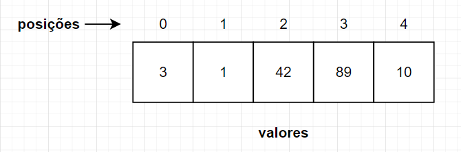

# Vetor (Array)

O vetor é uma estrutura de dados 1-D que armazena dados de um único tipo e possui tamanho fixo pré-definido.

## Regras

- Tamanho fixo pré-definido
- Armazena um único tipo de dado
- Pode ler, inserir, remover e buscar elementos

## Implementações

- [Python](../python/vetor.py)
